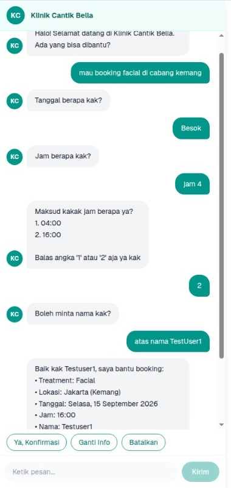
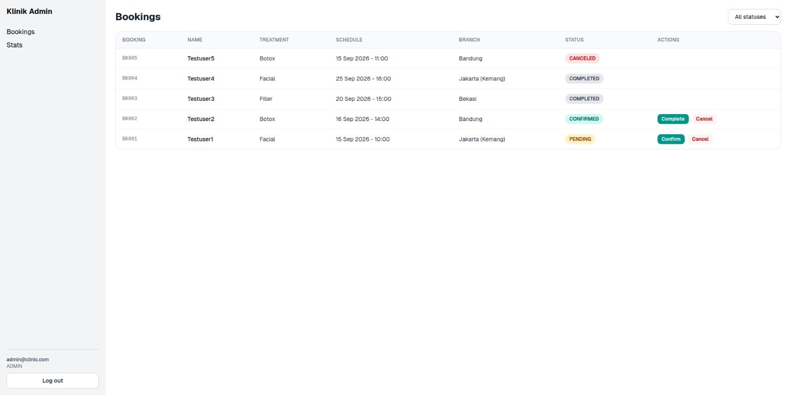

# Clinic CS

A chatbot and booking system for aesthetic clinics in Indonesia.

Customers chat in Bahasa Indonesia to ask about treatments and book an appointment. Clinic staff log into a dashboard to see those bookings and confirm or cancel them.

The bot takes a booking as a request. Staff confirm it. The bot never tells a customer that a slot is secured.





## What it does

For customers:
- Answers questions about treatments, prices and policies using RAG over a clinic knowledge base
- Takes a booking through chat, asking for one thing at a time
- Asks a follow up question when the input is unclear instead of picking an option itself
- Keeps the conversation in Redis, so a booking survives across messages

For clinic staff:
- Login with email and password, stays logged in after a page refresh
- Booking list with a status filter and Confirm / Cancel / Complete buttons
- Stats page (today, this week, pending, confirmed), refreshes every 30s
- Only ADMIN users can open the dashboard

## How a message is handled

`POST /api/chat` calls `handle_message(user_id, message)` in `chatbot.py`.

1. Load or create a `BookingSession` from Redis
2. If the bot is waiting on an answer to an unclear time, try to resolve that first
3. If a booking is already running: cancel, edit, confirm, answer an FAQ, or continue the booking
4. If not: `classify_intent()` sorts the message into BOOKING, FAQ, CHITCHAT or RESCHEDULE
5. Booking path: `extract_slots()`, `validate_slots()`, then ask for the first missing field or confirm
6. On confirmation: save the booking, clear the stats cache, clear the session

The LLM fills fields. It does not run the flow. Slot filling is the normal pattern for a task like this, and it is what lets "ganti tanggalnya" or "batal" work in the middle of a booking.

## Why the LLM does not calculate dates

Indonesian date phrases are hard to catch with regex. There are too many ways to write the same thing: senin depan, senen dpn, senin minggu depan, senin 2 minggu lagi, awal bulan depan. Each new pattern makes the rest harder to read. So the model handles the language.

But the model should not do the math. If the extractor returns `"tanggal": "2026-09-07"`, the date was worked out by the part of the system that is worst at it. Models get weekday math wrong often, and a wrong answer still looks like a valid date. It passes every check, and the customer ends up booked on a day they never asked for.

An error message the customer can see is a small problem. A booking on the wrong day is a big one.

So the rule is: the model classifies, Python calculates. The model turns a phrase into one of a few fixed intent types. Python does the arithmetic from today's date. The model never needs to know what today is, which removes that failure completely.

Regex is still used for input the system controls, like a digit reply to a numbered menu. It is not used for text a customer writes.

Unclear input is asked about, not guessed. "jam 4" could be 04:00 or 16:00, so the bot offers both and waits.

## Status

Working: API, chat widget, PostgreSQL, auth with refresh rotation, admin dashboard. The booking flow runs end to end when the input is clear.

In progress (Phase 4 of 8): getting the bot to handle real Indonesian input. That means replacing the rest of the regex date parsing with the intent types above, moving the treatment list out of the knowledge base and into SQL, adding conversation memory, and building a test harness so changes can be measured instead of guessed.

Not done yet:
- Relative weekday phrases like "senin depan" are not handled
- No capacity check. Ten customers can request the same slot. This is on purpose for now. The clinic's own book stays the source of truth and the bot is only an intake funnel
- `clinic_knowledge_base.txt` is sample data, not a real clinic's
- No human handoff. That comes with WhatsApp

Full plan, decision log, and a list of things this project will not build: [ROADMAP.md](ROADMAP.md)

## Built with

Backend:
- FastAPI
- PostgreSQL with SQLAlchemy 2.0 (async) and Alembic
- Redis for chat sessions, refresh tokens, and the stats cache
- LangChain and Chroma for RAG
- bcrypt and PyJWT for login

Frontend:
- React 19, TypeScript, Vite
- Tailwind CSS, shadcn/ui
- react-router-dom
- Zustand for auth state

Postgres and Redis run in Docker. The backend runs on the host.

The LLM provider is not settled yet, see step 4.0 in the roadmap. Ollama was used during early development and is not the production target.

## Folders

```
api/routes/       endpoints: chat, auth, bookings, health
auth/             JWT, password hashing, refresh tokens
booking/          intent, slot extraction, validation, session and stats storage
db/               database connection
models/           tables and request/response schemas
migrations/       Alembic
scripts/          seed_admin.py and manual tests
chatbot.py        main conversation logic
rag.py, vector.py RAG setup
main.py           app entry point

frontend/src/
  features/chat/  chat widget
  features/admin/ dashboard pages
  features/auth/  auth store, session restore, route guard
  lib/            fetch wrapper (adds the token, retries after refresh)
```

## Running it

**1. Database and Redis**

```bash
docker compose up -d
```

**2. Backend**

```bash
python -m venv venv
source venv/bin/activate
pip install -r requirements.txt
cp .env.example .env        # fill this in
python -m alembic upgrade head
python -m scripts.seed_admin
uvicorn main:app --reload
```

Runs on http://localhost:8000. Docs at /docs.

**3. Frontend**

```bash
cd frontend
npm install
echo "VITE_API_URL=http://localhost:8000" > .env
npm run dev
```

Runs on http://localhost:5173. Chat is at `/`, dashboard is at `/admin`.

## Endpoints

| Method | Path | Who can call it |
|--------|------|-----------------|
| POST | `/api/chat` | anyone |
| POST | `/api/auth/login` | anyone |
| POST | `/api/auth/refresh` | needs the cookie |
| POST | `/api/auth/logout` | needs the cookie |
| GET | `/api/auth/me` | logged in |
| GET | `/api/admin/bookings` | admin |
| GET | `/api/admin/bookings/{id}` | admin |
| PATCH | `/api/admin/bookings/{id}/status` | admin |
| DELETE | `/api/admin/bookings/{id}` | admin |
| GET | `/api/admin/stats` | admin |
| GET | `/api/health` | anyone |

## Notes

- The access token lasts 15 minutes and is only kept in memory, never in localStorage. The refresh token lasts 7 days and lives in an httpOnly cookie, so a page refresh does not log you out. Refresh tokens are single use and reuse is detected.
- `api-client.ts` sends only one refresh request even if several calls get a 401 at the same moment. Without that, the second request would send a token id that was already used, which looks like a stolen token and kills the session.
- The stats endpoint saves its result in Redis for 30 seconds so it does not run the same 4 queries over and over. Any booking change deletes that saved value right away, so the numbers on screen are never stale because of it.
- Business logic runs in Asia/Jakarta through one `now_wib()` helper. Only token expiry uses UTC. Before this, "besok" resolved to the wrong day between 00:00 and 07:00 WIB.
- The list of missing fields used to be a Python `set`, so the order the bot asked questions in changed on every restart. It is ordered now.
- Restarting the Redis container wipes chat sessions and refresh tokens, so everyone gets logged out.
